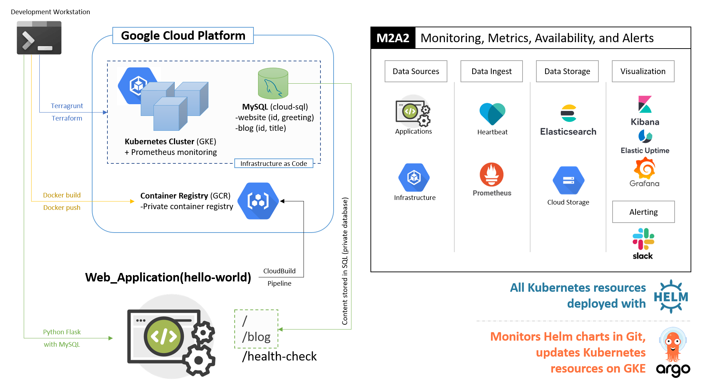

# Web Application Project

---

Purpose is to deploy a web application that stores/retrieves information from a database, is scalable and publicly available. Two of the core tenets of this application is to deploy the necessary Infrastructure as Code and a scalable application. What better to do this than Terraform/Terragrunt/Kubernetes...a fabulous combination.

#### Repository Structure and Contents

| Directory      | Description |
|----------------|-------------|
| docs | Repository documentation, images, etc. |
| helm-charts | Assortment of Helm charts for building the web app and supporting cast |
| infrastructure | Terraform modules and Terragrunt live structure for provisioning Infrastructure as Code (IaC) |
| scripts | An assortment of scripts to make life easier on us all |
| src | Where the magic happens: web app and supporting cast are assembled and published from this directory |

## System Architecture

---

#### System Components

| Item | Description |
|------|-------------|
| Web App | Python Flask, multiple routes, health-check, pulls website content from MySQl |
| MySQL DB | provisioned via Terragrunt/Terraform (IaC), hosts website content, includes sample data (blog posts) |
| Kubernetes cluster | provisioned via Terragrunt/Terraform (IaC), hosts the web app and monitoring stack |
| Containerized everything | web-app, supporting monitoring/metrics apps, pushed to private registry (GCR) for better security |
| Container Registry (GCR) | only available inside my GCP project (security boundary), images are scanned for vulnerabilities |
| Elasticsearch, Kibana, Grafana, Heartbeat | core monitoring stack, provisioned via Helm, provides availability, monitoring, and alerting |
| Prometheus stack | provides metrics for cluster (nodes, pods, apps, services), provisioned via Helm (vendor Helm chart) |
| ArgoCD | Continuous Deployment for designated apps, monitors Git for updates and applies them to Kubernetes resources, Helm charts in this case |

## M2A2 _(Monitoring, Metrics, Availability, and Alerting)_

---

#### Infrastructure and Application Monitoring and Availability

* Service Availability - are services up and running as expected? are there any errors (crit,err,warn)?
* Network Availability - can services communicate both vertically and horizontally?
* Security Monitoring - are service components compliant, scanned, vetted?

#### Application Metrics

* (Request) **R**ate - the number of requests, per second, your services are serving.
* (Request) **E**rrors - the number of failed requests per second.
* (Request) **D**uration - The amount of time each request takes expressed as a time interval

#### Alerting

* Service outage - why did the service outage occur? how long was the service outage? root cause? traceability?
* Immediate versus regular notifications - critical prod service down (why isn't it HA?)? need to know ASAP!

## Local Development

---

#### Running the Flask App Locally

* Install requirements (pip install -r requirements.txt)
* Modify the app as needed
* Run the app locally `` MYSQL_DATABASE_PASSWORD=$(cat password.txt) DB_HOST='34.73.152.50' python3 app.py ``

#### Running the Flask App Container

* Build the image locally `` docker -t web-app:test --build-arg DB_PASSWORD=$(cat password.txt) .``
* You will need the password.txt file (git ignores this file, because secrets...)
* Or use the container_manager.sh script (caution: it only works for my GCP project, it is there for an example, you can build the image and try that though)
* Run the app from container `` docker run -p 5000:5000 -e DB_HOST='34.73.152.50' -e DB_PASSWORD="$(cat password.txt)" gcr.io/cool-automata-328421/web-app:0.1.12 ``

## Deploying on the Cloud

---

_Note: this project has been deployed to Google Cloud Platform thanks to their generous trial credits_

* Container images are mainly sourced from open source tools
* Web app container will need to be built using some additional flavor (see local development above)
* Assumptions: you have access to a cloud platform (GCP in this case)
* You have general understanding of: IaC, application development, Kubernetes, Helm, containers...probably even an addiction to good coffee.

## Future Enhancements

---

#### To Do (hopefully can get all of this done)

- [x] CI pipeline to test/build/publish the app and container (unit test app, vulnerability scan)
- [x] Version app in pipeline
- [x] CD to continually deploy the app
- [x] Obtain a domain name
- [x] Obtain/apply SSL certificate
- [x] Put web app behind WAF -- Cloud Armor **_automatically_** protects HTTP(S) Load Balancer workloads from volumetric and protocol based DDoS attacks
- [x] Separate builds logically -- use git branching strategy to build in dev/stage/prod (quasi complete)
- [x] Establish internal domain/DNS/VMs to allow remote connections to internal-only apps
- [ ] Set up a real load balancer for k8s resources...but that means more overhead for us
- [ ] Set up HTTP redirect to HTTPS (GCLB isn't really good at this bit, yet...consider NGINX in the cluster)
- [ ] Add DNS configuration to Terraform (static IP/route/zone creation)

#### Deployment Strategy

* Choices in this endeavor, and a key point: let Google manage as much low level infrastructure as possible...so I can develop features
* Security and compliance - no apps get published to prod with vulnerabilities! Put gates in place.
* Infrastructure - deploy based on estimated workload (infra/live), scale up and out as needed with Terragrunt configs
* Canary deployments - cheaper, faster, more features get added without major pushes
* Blue-Green (dev, stage, pre-prod, prod) - useful with major changes to an app, wholesale upgrades
* Separate Kubernetes clusters - development, test, production
* Separate repos - applications, infrastructure (these get built via CI/CD not in same repo...otherwise commits will kick off unneeded app builds)
